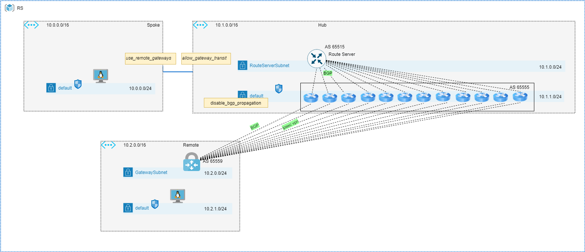
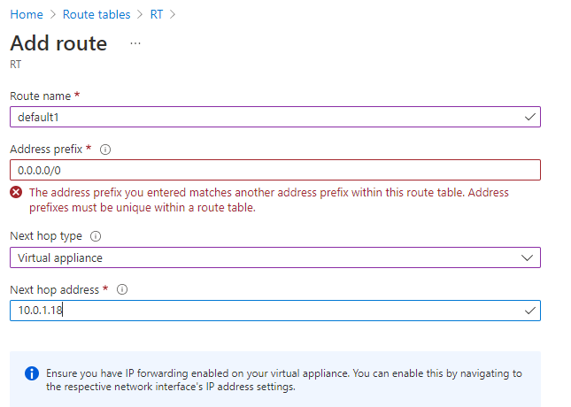

# ECMP via RouteSerer in Azure

## Summary

In this document, we will examine two methods for installing parallel routes in an Azure routing table - dynamically via the RouteServer and statically by using UDRs. 

## Overview

In the lab, the following topology was used. CSRs (NVAs) were scaled up to 16. In this exercise, we will try to create 16 sessions on the route server and observe the routing table in Spoke VNET and Remote VNET.



All BGP peers have a default route artificially injected by using the "default-originate" statement on Cisco CSR. 
```cisco
router bgp 65555
 bgp log-neighbor-changes
 neighbor 10.1.0.4 remote-as 65515
 neighbor 10.1.0.4 ebgp-multihop 255
 neighbor 10.1.0.4 disable-connected-check
 neighbor 10.1.0.4 default-originate
 neighbor 10.1.0.5 remote-as 65515
 neighbor 10.1.0.5 ebgp-multihop 255
 neighbor 10.1.0.5 disable-connected-check
 neighbor 10.1.0.5 default-originate
 neighbor 10.2.0.4 remote-as 65559
 neighbor 10.2.0.4 ebgp-multihop 255
 neighbor 10.2.0.4 update-source Loopback0
 neighbor 10.2.0.4 default-originate
 neighbor 10.2.0.5 remote-as 65559
 neighbor 10.2.0.5 ebgp-multihop 255
 neighbor 10.2.0.5 update-source Loopback0
 neighbor 10.2.0.5 default-originate
```

Because Terraform AzureRM provider did not have Route Server support at the time of writing this document, I employed local provisioner instead. You can find more information about local provisioner here. https://www.terraform.io/docs/language/resources/provisioners/local-exec.html#interpreter-examples

By using the os_profile / custom_data declaration, a CSR configuration is generated and injected during creation.

You must create SSH keys in advance and upload them to Azure SSH keys. The same holds true for usernames, passwords, and shared keys. See data.tf for details. 

Resource Group | Keyvault / storage | Key
------------ | ------------- | ---
CloudShell | cs-keystore | adminusername
CloudShell | cs-keystore | adminpassword
CloudShell | ssh keys | desktop
CloudSehll | cs-keystore | sharedkey

## Deployment

From the infrastructure folder run the following commands:
```
terraform init
terraform plan 
terraform apply
```
Active routes can be extracted from the deployed VMs by using the active_routes.sh script in the supplementals folder. 

## Observations

We cannot create more than 4 ( 8 as per documentation ) peers toward RouteServer. The error as follows :

```
Code="MaximumLocalNetworkSitesLimitReachedForGateway" Message="Maximum connection limit reached. Current site to site connections : 31, max limit : 30" Details=[]
```

Route server installed four parallel path to the Route Table of the Remote VNET:

```
../supplementals/active_routes.sh spoke-vnet-vm-vmLinux-0 $RG
Source                 State    Address Prefix    Next Hop Type          Next Hop IP
---------------------  -------  ----------------  ---------------------  -------------
Default                Active   10.0.0.0/16       VnetLocal
Default                Active   10.1.0.0/16       VNetPeering
VirtualNetworkGateway  Active   10.2.0.0/16       VirtualNetworkGateway  10.1.1.17
VirtualNetworkGateway  Active   10.2.0.0/16       VirtualNetworkGateway  10.1.1.12
VirtualNetworkGateway  Active   10.2.0.0/16       VirtualNetworkGateway  10.1.1.13
VirtualNetworkGateway  Active   10.2.0.0/16       VirtualNetworkGateway  10.1.1.9
VirtualNetworkGateway  Active   0.0.0.0/0         VirtualNetworkGateway  10.1.1.17
VirtualNetworkGateway  Active   0.0.0.0/0         VirtualNetworkGateway  10.1.1.12
VirtualNetworkGateway  Active   0.0.0.0/0         VirtualNetworkGateway  10.1.1.13
VirtualNetworkGateway  Active   0.0.0.0/0         VirtualNetworkGateway  10.1.1.9
```

Only four peers get successfully provisioned

```
az network routeserver peering list --routeserver RouteServer --resource-group RS -o table
Name    PeerAsn    PeerIp     ProvisioningState    ResourceGroup
------  ---------  ---------  -------------------  ---------------
CSR0    65555      10.1.1.17  Succeeded            RS
CSR1    65555      10.1.1.12  Succeeded            RS
CSR2    65555      10.1.1.13  Succeeded            RS
CSR3    65555      10.1.1.9   Succeeded            RS
CSR4    65555      10.1.1.4   Failed               RS
CSR5    65555      10.1.1.19  Failed               RS
CSR6    65555      10.1.1.18  Failed               RS
CSR7    65555      10.1.1.16  Failed               RS
CSR8    65555      10.1.1.11  Failed               RS
CSR9    65555      10.1.1.10  Failed               RS
CSR10   65555      10.1.1.7   Failed               RS
CSR11   65555      10.1.1.20  Failed               RS
CSR12   65555      10.1.1.8   Failed               RS
CSR13   65555      10.1.1.15  Failed               RS
CSR14   65555      10.1.1.14  Failed               RS
CSR15   65555      10.1.1.6   Failed               RS
```

Remote VNET has only one default route installed, however prefixes toward more specific destinations gets load-balanced between active instances of VPN Gateway.

```
./supplementals/active_routes.sh remote-vnet-vm-vmLinux-0 $RG
Source                 State    Address Prefix     Next Hop Type          Next Hop IP
---------------------  -------  -----------------  ---------------------  -------------
Default                Active   10.2.0.0/16        VnetLocal
VirtualNetworkGateway  Active   192.168.100.5/32   VirtualNetworkGateway  10.2.0.4
VirtualNetworkGateway  Active   192.168.100.5/32   VirtualNetworkGateway  10.2.0.5
VirtualNetworkGateway  Active   192.168.100.10/32  VirtualNetworkGateway  10.2.0.4
VirtualNetworkGateway  Active   192.168.100.10/32  VirtualNetworkGateway  10.2.0.5
VirtualNetworkGateway  Active   192.168.100.15/32  VirtualNetworkGateway  10.2.0.4
VirtualNetworkGateway  Active   192.168.100.15/32  VirtualNetworkGateway  10.2.0.5
VirtualNetworkGateway  Active   192.168.100.4/32   VirtualNetworkGateway  10.2.0.4
VirtualNetworkGateway  Active   192.168.100.4/32   VirtualNetworkGateway  10.2.0.5
VirtualNetworkGateway  Active   192.168.100.2/32   VirtualNetworkGateway  10.2.0.4
VirtualNetworkGateway  Active   192.168.100.2/32   VirtualNetworkGateway  10.2.0.5
VirtualNetworkGateway  Active   192.168.100.14/32  VirtualNetworkGateway  10.2.0.4
VirtualNetworkGateway  Active   192.168.100.14/32  VirtualNetworkGateway  10.2.0.5
VirtualNetworkGateway  Active   192.168.100.1/32   VirtualNetworkGateway  10.2.0.4
VirtualNetworkGateway  Active   192.168.100.1/32   VirtualNetworkGateway  10.2.0.5
VirtualNetworkGateway  Active   192.168.100.12/32  VirtualNetworkGateway  10.2.0.4
VirtualNetworkGateway  Active   192.168.100.12/32  VirtualNetworkGateway  10.2.0.5
VirtualNetworkGateway  Active   0.0.0.0/0          VirtualNetworkGateway  10.2.0.5
VirtualNetworkGateway  Active   192.168.100.13/32  VirtualNetworkGateway  10.2.0.4
VirtualNetworkGateway  Active   192.168.100.13/32  VirtualNetworkGateway  10.2.0.5
VirtualNetworkGateway  Active   192.168.100.8/32   VirtualNetworkGateway  10.2.0.4
VirtualNetworkGateway  Active   192.168.100.8/32   VirtualNetworkGateway  10.2.0.5
VirtualNetworkGateway  Active   192.168.100.7/32   VirtualNetworkGateway  10.2.0.4
VirtualNetworkGateway  Active   192.168.100.7/32   VirtualNetworkGateway  10.2.0.5
VirtualNetworkGateway  Active   192.168.100.11/32  VirtualNetworkGateway  10.2.0.4
VirtualNetworkGateway  Active   192.168.100.11/32  VirtualNetworkGateway  10.2.0.5
VirtualNetworkGateway  Active   192.168.100.6/32   VirtualNetworkGateway  10.2.0.4
VirtualNetworkGateway  Active   192.168.100.6/32   VirtualNetworkGateway  10.2.0.5
VirtualNetworkGateway  Active   10.0.0.0/16        VirtualNetworkGateway  10.2.0.4
VirtualNetworkGateway  Active   10.0.0.0/16        VirtualNetworkGateway  10.2.0.5
VirtualNetworkGateway  Active   192.168.100.9/32   VirtualNetworkGateway  10.2.0.4
VirtualNetworkGateway  Active   192.168.100.9/32   VirtualNetworkGateway  10.2.0.5
VirtualNetworkGateway  Active   192.168.100.0/32   VirtualNetworkGateway  10.2.0.4
VirtualNetworkGateway  Active   192.168.100.0/32   VirtualNetworkGateway  10.2.0.5
VirtualNetworkGateway  Active   192.168.100.3/32   VirtualNetworkGateway  10.2.0.4
VirtualNetworkGateway  Active   192.168.100.3/32   VirtualNetworkGateway  10.2.0.5
VirtualNetworkGateway  Active   10.1.0.0/16        VirtualNetworkGateway  10.2.0.4
VirtualNetworkGateway  Active   10.1.0.0/16        VirtualNetworkGateway  10.2.0.5
```

We **cannot** create parallel path manually

```
IDX=0
for peer in ${peers}; do
    az network route-table route create --address-prefix 0.0.0.0/0 \
                                    --name default${IDX} \
                                    --next-hop-type VirtualAppliance \
                                    --route-table-name RT \
                                    --resource-group ${RG} \
                                    --next-hop-ip-address $peer
    let IDX=$IDX+1
    echo $IDX
done

(RouteConflict) Route: default1 conflicts with Route: default0. Routes cannot have the same AddressPrefix.
```

or via the portal :



Note: CSR image might require accepting terms

```
az vm image terms accept --publisher cisco --offer cisco-csr-1000v --plan "17_3_2-byol"
```
